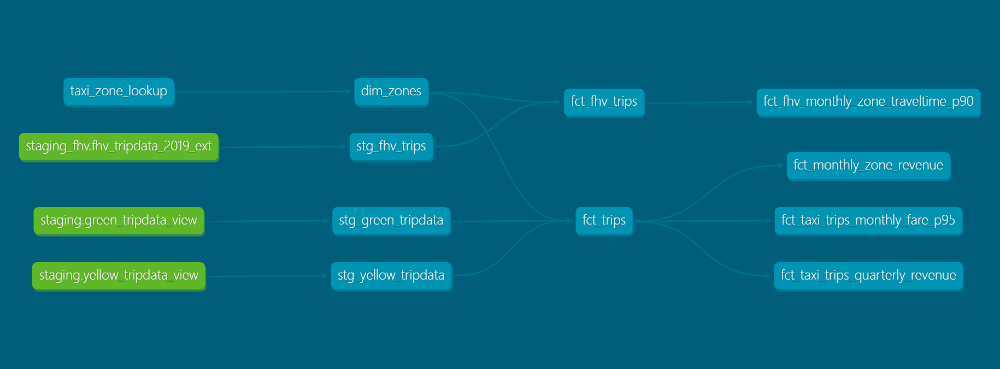

# This project utilize DBT core for NY_taxi dataset ELT process to GCP BigQuery

===

## Dataset used

- [Green Taxi dataset (2019 and 2020)](https://github.com/DataTalksClub/nyc-tlc-data/releases/tag/green)
- [Yellow Taxi dataset (2019 and 2020)](https://github.com/DataTalksClub/nyc-tlc-data/releases/tag/yellow)
- [For Hire Vehicle dataset (2019)](https://github.com/DataTalksClub/nyc-tlc-data/releases/tag/fhv) 

## Project DAG



===
## Install dbt core and connect with BigQuery

```bash
pip instll dbt-core
pip install dbt-bigquery
```

Initialize a dbt project

```bash
dbt init DEZ_hw4
```

Change the project dataset region to match the GCS external table region  

```bash 
vi ~/.dbt/profile.yaml
```

There are 24 external tables in bigquery for green and yellow tripdata respectively. For dbt can easy to process all the tripdata, create a main table view for yellow and green tripdata  

```bash
gcloud beta interactive
```

```bash
bq query --use_legacy_sql=false --location=australia-southeast1 'CREATE OR REPLACE VIEW `dez-jimmyh.w2_kestra_dataset.green_tripdata_view` AS
SELECT * FROM `dez-jimmyh.w2_kestra_dataset.green_2019-01_tripdata_ext`
UNION ALL
SELECT * FROM `dez-jimmyh.w2_kestra_dataset.green_2019-02_tripdata_ext`
UNION ALL
...
UNION ALL
SELECT * FROM `dez-jimmyh.w2_kestra_dataset.green_2020-11_tripdata_ext`
UNION ALL
SELECT * FROM `dez-jimmyh.w2_kestra_dataset.green_2020-12_tripdata_ext`;'
```

===

Q1:
**Ans:select * select * from myproject.raw_nyc_tripdata.ext_green_taxi**   
When DBT is executed, it tries to read env variable in order:

1. Reading environment variables from Shell/Terminal
2. Read from .env or dbt_project.yml
3. Use a default value provided by env_var() (e.g. 'dtc_zoomcamp_2025')

Here, the environment variables are set as:

```bash
export DBT_BIGQUERY_PROJECT=myproject
export DBT_BIGQUERY_DATASET=my_nyc_tripdata
```

The model query will compile as:

- env_var('DBT_BIGQUERY_PROJECT', 'dtc_zoomcamp_2025') →  "myproject"
- env_var('DBT_BIGQUERY_SOURCE_DATASET', 'raw_nyc_tripdata') →  "raw_nyc_tripdata"
    (**No 'DBT_BIGQUERY_SOURCE_DATASET' this env. variable, use the default value instead.**)

```sql
select * 
from {{ source('raw_nyc_tripdata', 'ext_green_taxi' ) }}
```

would compile as

```sql
select * 
from `myproject.my_nyc_tripdata.ext_green_taxi`
```

---
Q2: How to make command line arguments takes precedence over ENV_VARs, which takes precedence over DEFAULT value?  
**Ans:Update the WHERE clause to pickup_datetime >= CURRENT_DATE - INTERVAL '{{ var("days_back", env_var("DAYS_BACK", "30")) }}' DAY**  

By seting a variable 'days_back', dbt will execute with this variable, if command doesn't not specify the variable, dbt will use ENV_variable 'DAYS_BACK' with default value 30.  

---
Q3: The option that does NOT apply for materializing fct_taxi_monthly_zone_revenue  
**Ans:dbt run --select models/staging/+**

The model 'fct_taxi_monthly_zone_revenue' is at the downstrem of 'dim_taxi_trips', which is located in core/, and depend on models in staging. However, 'fct_taxi_monthly_zone_revenue' does not depend on models in staging directly. Therefore, the command "models/staging/+" would only execute models in staging and models depend on them directly.

---
Q4:  

```sql


    
    

     {{- env_var(target_env_var) -}}
                        {{- env_var(stging_env_var, env_var(target_env_var)) -}}
    


```

This dbt macro (resolve_schema_for) dynamically resolves the schema (dataset) for a given model type by checking environment variables.  
If the model_type is 'core', the macro retrieves the value of DBT_BIGQUERY_TARGET_DATASET and returns it. 
If the model_type is not 'core', it first tries to get DBT_BIGQUERY_STAGING_DATASET.  
If DBT_BIGQUERY_STAGING_DATASET is not set, it falls back to DBT_BIGQUERY_TARGET_DATASET. 

At models set as:  

```sql 
{{ config(
    schema=resolve_schema_for('core'), 
) }}
```

**Ans:**  

- **Setting a value for DBT_BIGQUERY_TARGET_DATASET env var is mandatory, or it'll fail to compile.--correct**
- **Setting a value for DBT_BIGQUERY_STAGING_DATASET env var is mandatory, or it'll fail to compile--incorrect: If DBT_BIGQUERY_STAGING_DATASET is not set, dbt will still compile using DBT_BIGQUERY_TARGET_DATASET.**
- **When using core, it materializes in the dataset defined in DBT_BIGQUERY_TARGET_DATASET--correct**
- **When using stg, it materializes in the dataset defined in DBT_BIGQUERY_STAGING_DATASET, or defaults to DBT_BIGQUERY_TARGET_DATASET --correct**
- **When using staging, it materializes in the dataset defined in DBT_BIGQUERY_STAGING_DATASET, or defaults to DBT_BIGQUERY_TARGET_DATASET--correct**

---
Q5: Which were the yearly quarters with the best (or less worse) and worst results for green, and yellow?  
**Ans:green: {best: 2020/Q1, worst: 2020/Q2}, yellow: {best: 2020/Q1, worst: 2020/Q2}**  

```sql
WITH quarterly_revenue AS (
    SELECT 
        service_type, 
        year, 
        quarter, 
        SUM(revenue_quarterly_total_amount) AS total_revenue
    FROM `dez-jimmyh.DEZ_hw4_dbt.fct_taxi_trips_quarterly_revenue`
    GROUP BY service_type, year, quarter
),
prev_re AS (
    SELECT *,
        LAG(total_revenue, 4) OVER (PARTITION BY service_type ORDER BY year, quarter) AS prev_revenue
    FROM quarterly_revenue
)

SELECT *, (total_revenue - prev_revenue)/prev_revenue *100 AS yoy_growth FROM prev_re WHERE year = 2020
```

---
Q6: What are the values of p97, p95, p90 for Green Taxi and Yellow Taxi, in April 2020?  
**Ans:green: {p97: 55.0, p95: 45.0, p90: 26.5}, yellow: {p97: 31.5, p95: 25.5, p90: 19.0}**  

```sql
SELECT service_type, revenue_year, revenue_month, AVG(fare_p90) AS p90, AVG(fare_p95) AS p95, AVG(fare_p97) AS p97
FROM `dez-jimmyh.DEZ_hw4_dbt.fct_taxi_trips_monthly_fare_p95`
WHERE revenue_year = 2020 AND revenue_month = 4
GROUP BY service_type, revenue_year, revenue_month;
```

---
Q7: For the Trips that respectively started from Newark Airport, SoHo, and Yorkville East, in November 2019, what are dropoff_zones with the 2nd longest p90 trip_duration ?  
**Ans:LaGuardia Airport, Chinatown, Garment District**  

```sql
SELECT pickup_zone, pickup_year, pickup_month, dropoff_zone, trip_duration_p90 FROM `dez-jimmyh.DEZ_hw4_dbt.fct_fhv_monthly_zone_traveltime_p90`
WHERE pickup_zone = 'Yorkville East' AND pickup_year = 2019 AND pickup_month = 11
ORDER BY trip_duration_p90 DESC LIMIT 10;
-- Newark Airport -> LaGuardia Airport
-- SoHo -> Chinatown
-- Yorkville East -> Garment District
```
